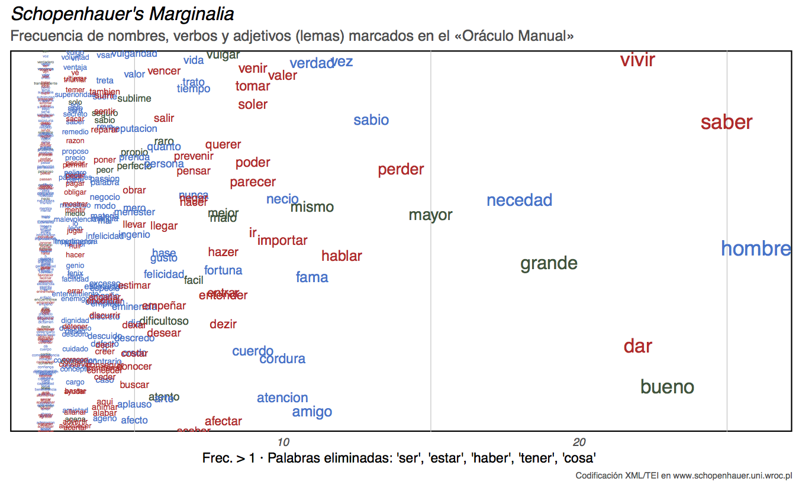

# Visualización del texto marcado por Schopenhauer en el _Oráculo manual_

Datos y código en `ggplot2` para la visualización recogida en el artículo  "Lecturas españolas en las bibliotecas de Schopenhauer y Nietzsche", publicado en [_España en Alemania. Ínsula_](https://www.insula.es/revista/espana-en-alemania), n° 867, marzo de 2019.  

El texto marcado por Schopenhauer en su ejemplar del _Oráculo manual y arte de prudencia_  (_vide_ la edición [Schopenhauer's Library](http://schopenhauer.uni.wroc.pl) disponible en XML-TEI) se ha procesado con [Freeling 4.1.](http://nlp.cs.upc.edu/freeling) para etiquetarlo gramaticalmente y extraer automáticamente los lemas de adjetivos, nombres y verbos.  

Las tablas finales han sido retocadas manualmente para eliminar etiqueción errónea de Freeling, alguna palabra cortada en origen y palabras con una frecuencia elevada: 'ser', 'estar', 'haber', 'tener', 'cosa'.

```
> verbs
                 x freq
1            saber   25
2              dar   22
3            vivir   22
4           perder   14
```


